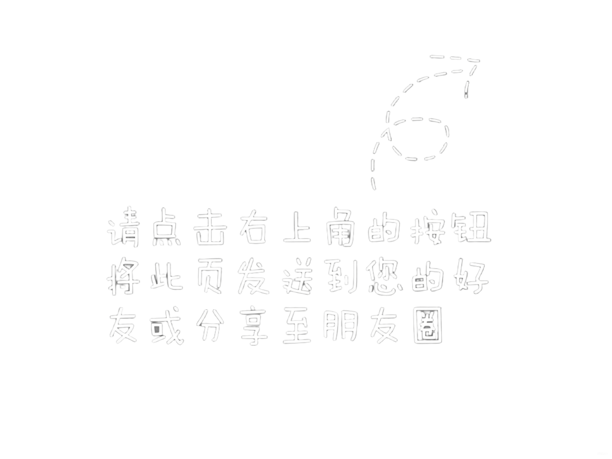

# 图片 404 错误修复说明

## 问题
在浏览器中运行游戏时，出现图片 404 错误：
- `share_timeline.png:1 Failed to load resource: the server responded with a status of 404`

## 原因
二维码和分享图片在 HTML 中直接引用静态路径，但在 Cocos Creator 构建后的环境中，资源路径不同。

## 解决方案

### 方案一：使用原始静态文件（推荐用于开发）

直接使用原始项目的 HTML 方式，不需要通过 Cocos Creator 构建：

1. 使用原版 `caishen1.0.php` 文件（已存在）
2. 该文件已经包含完整的游戏逻辑和弹窗功能
3. 所有图片路径都使用正确的相对路径

### 方案二：在 Cocos Creator 构建后调整

如果坚持使用 Cocos Creator，构建后需要：

1. **构建游戏**：在 Cocos Creator 中构建为 Web 平台

2. **复制资源文件**：
   ```bash
   # 将原始图片复制到构建目录
   xcopy assets\resources\images\caishen\qrcode.png build\web-mobile\assets\resources\images\caishen\
   xcopy assets\resources\images\caishen\share_timeline.png build\web-mobile\assets\resources\images\caishen\
   ```

3. **修改 HTML**：在 `build/web-mobile/index.html` 中更新图片路径：
   ```html
   <!-- 查找并更新图片 src -->
   
   
   ```

### 方案三：使用 Data URL（推荐用于生产）

修改 `MainScene.ts`，将图片转换为 Base64 Data URL：

```typescript
// 在 openQrcodePopup() 方法中
cc.resources.load('images/caishen/qrcode', cc.SpriteFrame, (err, spriteFrame) => {
    if (!err && spriteFrame && spriteFrame.getTexture()) {
        const texture = spriteFrame.getTexture();
        const img = document.getElementById('qrcode-img');
        if (img) {
            // 使用原生 URL
            img.src = texture.nativeUrl || texture.url;
        }
    }
});
```

## 当前实现

`MainScene.ts` 已更新为使用 `texture.nativeUrl`，这是 Cocos Creator 提供的正确方式获取资源 URL。

## 测试步骤

1. 在 Cocos Creator 中运行游戏
2. 点击烧香按钮
3. 观察浏览器控制台是否还有 404 错误
4. 弹窗中的图片是否正常显示

## 注意事项

- 在 Cocos Creator 编辑器中预览时，资源路径可能与构建后不同
- 建议在真实浏览器中测试，而不是编辑器预览
- 构建后的资源会被压缩和优化，路径会发生变化

## 推荐方案

**最简单的方法**：使用原版 `caishen1.0.php`，它已经完全可用且功能完整。

**如果需要 Cocos Creator**：
1. 先在编辑器中完成开发
2. 构建为 Web 平台
3. 手动复制必要的静态资源到构建目录
4. 调整 HTML 中的资源路径
